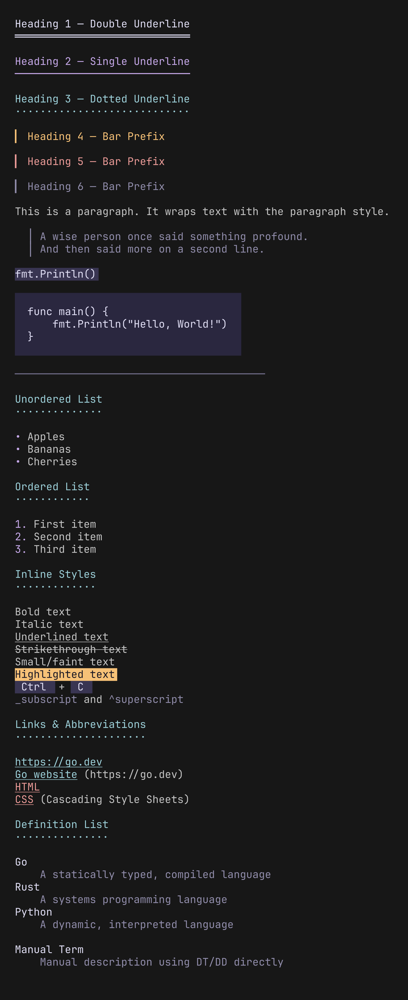

<h1 align="center">
  herald
</h1>

<h2 align="center" style="font-size: 1.5rem;">
    HTML-inspired typography for terminal UIs in Go.
</h2>

<p align="center">
  <a href="https://github.com/indaco/herald/actions/workflows/ci.yml" target="_blank">
    
  </a>
  <a href="https://codecov.io/gh/indaco/herald" target="_blank">
    
  </a>
  <a href="https://goreportcard.com/report/github.com/indaco/herald" target="_blank">
    
  </a>
  <a href="https://github.com/indaco/herald/security" target="_blank">
    
  </a>
  <a href="https://github.com/indaco/herald/releases" target="_blank">
    
  </a>
  <a href="https://pkg.go.dev/github.com/indaco/herald" target="_blank">
    
  </a>
  <a href="LICENSE" target="_blank">
    
  </a>
  <a href="https://www.jetify.com/devbox" target="_blank">
    
  </a>
</p>

Herald maps familiar HTML elements (H1–H6, P, Blockquote, UL, OL, Code, HR, and inline styles) to styled terminal output, built on [lipgloss v2](https://charm.land/lipgloss/v2). It ships with a Rose Pine-inspired default theme and supports full style customization via functional options.

<p align="center">
  
</p>

## Installation

```sh
go get github.com/indaco/herald
```

Requires Go 1.25 or later.

## Quick start

```go
package main

import (
    "fmt"
    "github.com/indaco/herald"
)

func main() {
    ty := herald.New()

    fmt.Println(ty.H1("Getting Started"))
    fmt.Println(ty.P("Herald renders terminal typography using lipgloss styles."))
    fmt.Println(ty.UL("Headings", "Block elements", "Inline styles"))
}
```

## Available elements

### Headings

H1–H3 render with a repeated underline character beneath the text. H4–H6 render with a left bar prefix.

| Method     | Decoration | Default character |
| ---------- | ---------- | ----------------- |
| `H1(text)` | underline  | `═`               |
| `H2(text)` | underline  | `─`               |
| `H3(text)` | underline  | `·`               |
| `H4(text)` | bar prefix | `▎`               |
| `H5(text)` | bar prefix | `▎`               |
| `H6(text)` | bar prefix | `▎`               |

### Block elements

| Method                  | Description                                                                                 |
| ----------------------- | ------------------------------------------------------------------------------------------- |
| `P(text)`               | Paragraph                                                                                   |
| `Blockquote(text)`      | Indented block with a left bar; supports multi-line input                                   |
| `Code(text, lang)`      | Inline code with background highlight; `lang` is optional, used when a CodeFormatter is set |
| `CodeBlock(text, lang)` | Fenced code block with padding; `lang` is optional, used when a CodeFormatter is set        |
| `HR()`                  | Horizontal rule, configurable width and character                                           |

```go
fmt.Println(ty.Blockquote("First line.\nSecond line."))
fmt.Println(ty.Code("os.Exit(1)"))
fmt.Println(ty.CodeBlock("func main() {\n\tfmt.Println(\"hello\")\n}"))
fmt.Println(ty.HR())
```

### Lists

```go
fmt.Println(ty.UL("Apples", "Bananas", "Cherries"))
fmt.Println(ty.OL("First", "Second", "Third"))
```

`UL` uses a bullet character (default `•`). `OL` uses `1.`, `2.`, `3.` markers.

### Inline styles

| Method                | Renders as                                                                  |
| --------------------- | --------------------------------------------------------------------------- |
| `Bold(text)`          | Bold                                                                        |
| `Italic(text)`        | Italic                                                                      |
| `Underline(text)`     | Underlined                                                                  |
| `Strikethrough(text)` | Strikethrough                                                               |
| `Small(text)`         | Faint                                                                       |
| `Mark(text)`          | Highlighted background                                                      |
| `Link(label, url)`    | Styled link; `url` is optional — when both differ, renders as `label (url)` |
| `Kbd(text)`           | Keyboard key indicator                                                      |
| `Abbr(abbr, desc)`    | Abbreviation; `desc` is optional, appended in parentheses                   |
| `Sub(text)`           | Subscript, prefixed with `_`                                                |
| `Sup(text)`           | Superscript, prefixed with `^`                                              |

```go
fmt.Println(ty.Bold("important") + " and " + ty.Italic("nuanced"))
fmt.Println(ty.Kbd("Ctrl") + " + " + ty.Kbd("C"))
fmt.Println(ty.Link("Go website", "https://go.dev"))
fmt.Println(ty.Abbr("CSS", "Cascading Style Sheets"))
fmt.Println(ty.Sub("2") + "O" + ty.Sup("n"))
```

### Definition lists

`DL` accepts a slice of `[2]string` pairs (term, description). `DT` and `DD` are available for individual rendering.

```go
fmt.Println(ty.DL([][2]string{
    {"Go", "A statically typed, compiled language"},
    {"Rust", "A systems programming language"},
}))

// Or individually:
fmt.Println(ty.DT("Term"))
fmt.Println(ty.DD("The description for that term."))
```

## Customization

### Functional options

Pass options to `herald.New()` to override individual styles or tokens.

```go
ty := herald.New(
    herald.WithHRWidth(60),
    herald.WithBulletChar("-"),
    herald.WithH1Style(
        lipgloss.NewStyle().Bold(true).Foreground(lipgloss.Color("#FF0000")),
    ),
)
```

**Style options** — each accepts a `lipgloss.Style`:

| Option                        | Targets                |
| ----------------------------- | ---------------------- |
| `WithH1Style` – `WithH6Style` | Heading levels 1–6     |
| `WithParagraphStyle`          | `P`                    |
| `WithBlockquoteStyle`         | `Blockquote`           |
| `WithCodeInlineStyle`         | `Code`                 |
| `WithCodeBlockStyle`          | `CodeBlock`            |
| `WithHRStyle`                 | `HR`                   |
| `WithBoldStyle`               | `Bold`                 |
| `WithItalicStyle`             | `Italic`               |
| `WithUnderlineStyle`          | `Underline`            |
| `WithStrikethroughStyle`      | `Strikethrough`        |
| `WithSmallStyle`              | `Small`                |
| `WithMarkStyle`               | `Mark`                 |
| `WithLinkStyle`               | `Link`                 |
| `WithKbdStyle`                | `Kbd`                  |
| `WithAbbrStyle`               | `Abbr`                 |
| `WithListBulletStyle`         | Bullet/number marker   |
| `WithListItemStyle`           | List item text         |
| `WithDTStyle`                 | Definition term        |
| `WithDDStyle`                 | Definition description |

**Token options** — each accepts a `string` or `int`:

| Option                   | Default | Description                         |
| ------------------------ | ------- | ----------------------------------- |
| `WithH1UnderlineChar(c)` | `═`     | Underline character for H1          |
| `WithH2UnderlineChar(c)` | `─`     | Underline character for H2          |
| `WithH3UnderlineChar(c)` | `·`     | Underline character for H3          |
| `WithHeadingBarChar(c)`  | `▎`     | Bar prefix character for H4–H6      |
| `WithBulletChar(c)`      | `•`     | Bullet character for `UL`           |
| `WithHRChar(c)`          | `─`     | Character repeated for `HR`         |
| `WithHRWidth(w)`         | `40`    | Width of `HR` in characters         |
| `WithBlockquoteBar(c)`   | `│`     | Left bar character for `Blockquote` |

### Code formatting

`WithCodeFormatter` accepts a `func(code, language string) string` callback. When set, `Code()` and `CodeBlock()` pass the raw text and language string to the formatter before applying the lipgloss style. When not set (the default), behavior is unchanged.

```go
import (
    "strings"

    "github.com/alecthomas/chroma/v2/quick"
    "github.com/indaco/herald"
)

func chromaFormatter(style string) func(code, language string) string {
    return func(code, language string) string {
        var buf strings.Builder
        err := quick.Highlight(&buf, code, language, "terminal256", style)
        if err != nil {
            return code
        }
        return strings.TrimRight(buf.String(), "\n")
    }
}

ty := herald.New(
    herald.WithCodeFormatter(chromaFormatter("catppuccin-mocha")),
)

fmt.Println(ty.CodeBlock(`func main() { fmt.Println("hello") }`, "go"))
```

See [`examples/syntax-highlighting/`](examples/syntax-highlighting/) for a chroma-based example, or [`examples/tree-sitter-highlighting/`](examples/tree-sitter-highlighting/) for a tree-sitter-based alternative.

### Custom theme

Replace the entire theme by constructing a `Theme` struct and passing it with `WithTheme`.

```go
import (
    "github.com/indaco/herald"
    "charm.land/lipgloss/v2"
)

custom := herald.Theme{
    H1:        lipgloss.NewStyle().Bold(true).Foreground(lipgloss.Color("#FFFFFF")),
    H2:        lipgloss.NewStyle().Bold(true).Foreground(lipgloss.Color("#AAAAAA")),
    Paragraph: lipgloss.NewStyle().MarginBottom(1),
    // set remaining Theme fields as needed...

    H1UnderlineChar: "=",
    H2UnderlineChar: "-",
    H3UnderlineChar: ".",
    HeadingBarChar:  ">",
    BulletChar:      "*",
    HRChar:          "-",
    HRWidth:         40,
    BlockquoteBar:   "|",
}

ty := herald.New(herald.WithTheme(custom))
```

`DefaultTheme()` is exported and can serve as a starting point: call it, modify the fields you need, then pass the result to `WithTheme`.

## Examples

Runnable examples are in the [`examples/`](examples/) directory:

| Example                                                        | Description                                                                                | Run                                                |
| -------------------------------------------------------------- | ------------------------------------------------------------------------------------------ | -------------------------------------------------- |
| [basic](examples/basic/)                                       | All elements with the default Rose Pine theme                                              | `go run ./examples/basic/`                         |
| [custom-options](examples/custom-options/)                     | Override styles, decoration chars, and tokens via functional options                       | `go run ./examples/custom-options/`                |
| [catppuccin-theme](examples/catppuccin-theme/)                 | Build a full theme from the [Catppuccin](https://catppuccin.com) palette (separate module) | `cd examples/catppuccin-theme && go run .`         |
| [syntax-highlighting](examples/syntax-highlighting/)           | Plug in chroma for syntax-highlighted code blocks (separate module)                        | `cd examples/syntax-highlighting && go run .`      |
| [tree-sitter-highlighting](examples/tree-sitter-highlighting/) | Plug in tree-sitter for AST-based syntax highlighting (separate module)                    | `cd examples/tree-sitter-highlighting && go run .` |

The catppuccin-theme, syntax-highlighting, and tree-sitter-highlighting examples each have their own `go.mod` to keep external dependencies out of herald's core module.

## License

This project is licensed under the MIT License - see the [LICENSE](./LICENSE) file for details.
